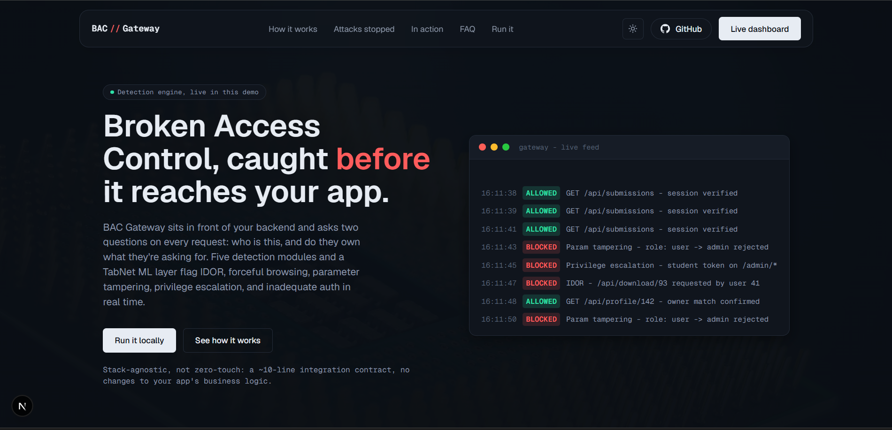
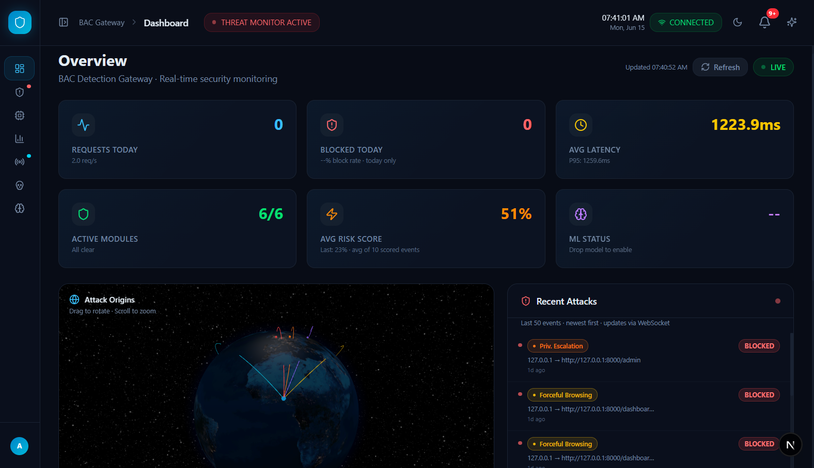
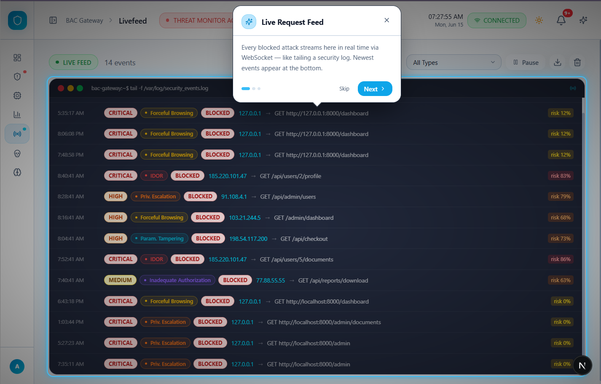
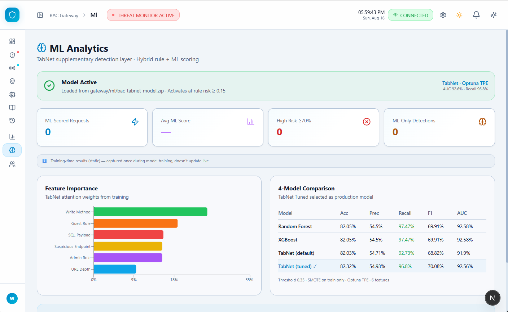
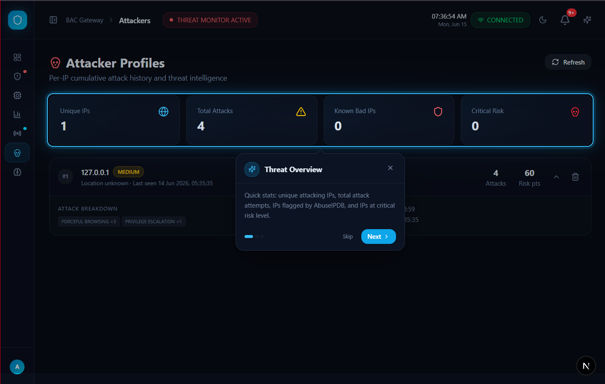

<div align="center">

# BAC Gateway, Landing Page

Marketing and documentation site for BAC Gateway, a stack-agnostic reverse proxy that detects and blocks Broken Access Control attacks before they reach your application.

[](https://bac-landing-page.vercel.app)
[](https://github.com/war-riz/bac-gateway)
[](./LICENSE)
[](https://github.com/war-riz/bac-landing-page/stargazers)

</div>

<br/>

<p align="center">
  
</p>

## What is BAC Gateway

BAC Gateway is a real-time API gateway that sits in front of any web application and inspects every request before it reaches your backend. It answers two questions on every single request: who is this, and do they actually own what they are asking for.

Five rule-based detection modules plus a TabNet machine learning layer work together to catch Broken Access Control attacks, one of the most common and most under-tested categories of web vulnerability.

This repository is the public-facing landing page for the project. It explains what BAC Gateway does, walks through how the detection pipeline works, and links out to the live dashboard and the gateway's own source code. The gateway itself lives in a separate repository: [war-riz/bac-gateway](https://github.com/war-riz/bac-gateway).

## What it catches

| Attack type | What it looks like |
|---|---|
| IDOR | A user swaps an ID in a URL or request body and reaches another user's data, with no ownership check in the way. |
| Forceful browsing | A user reaches an admin or internal route directly by URL, skipping the navigation meant to gate it. |
| Parameter tampering | Hidden fields, prices, or role values are edited client side and submitted as if they came from the server. |
| Privilege escalation | A standard user account performs an action or reaches a resource reserved for a higher privileged role. |
| Inadequate authentication | Expired, reused, or otherwise weak session state is accepted by the app when it should have been rejected. |

## How the detection pipeline works

1. **Request arrives.** Traffic bound for the protected app hits the gateway first, acting as a reverse proxy.
2. **Session probe.** The gateway calls the app's own auth check endpoint: is this request authenticated, and as whom.
3. **Resource check.** A second call confirms ownership: does this user actually have rights to what they are requesting.
4. **Allow or block.** Five rule based detectors plus a TabNet model score the request. Violations are blocked and logged in real time.

Integrating an existing app with the gateway is a roughly ten line contract, two small endpoints, no changes to the app's own business logic. It works with any backend framework, Flask, Django, Express, Laravel, Rails, or anything else that can return JSON.

## Screenshots

<p align="center">
  
  <br/><em>Dashboard overview, dark theme</em>
</p>

<p align="center">
  
  <br/><em>Live feed of incoming requests and their allow or block outcome</em>
</p>

<p align="center">
  
  <br/><em>ML layer, TabNet risk scoring</em>
</p>

<p align="center">
  
  <br/><em>Attacker profiling by source</em>
</p>

## Tech stack

- Next.js (App Router)
- TypeScript
- Tailwind CSS
- Framer Motion, for scroll and reveal animations
- Deployed as a fully static site, no backend of its own

## Project structure

```
app/                  Routes, layout, sitemap, robots
components/
  effects/             Scroll and reveal animation primitives
  sections/            Page sections: hero, how it works, attack grid, FAQ, footer, and so on
  ui/                   Shared UI building blocks: buttons, cards, accordion, carousel
lib/                    Copy, structured content data, shared helpers
public/
  illustrations/        SVG illustrations used across sections
  images/                Background textures
  screenshots/           Real product screenshots pulled from the dashboard
types/                  Shared TypeScript types
```

## Running it locally

Clone the repository:

```bash
git clone https://github.com/war-riz/bac-landing-page.git
cd bac-landing-page
```

Install dependencies:

```bash
npm install
```

Start the dev server:

```bash
npm run dev
```

Open [http://localhost:3000](http://localhost:3000) in your browser.

No environment variables or backend services are required to run this repository. It is a static marketing site with no API calls of its own.

## Related links

- Live dashboard demo: see `links.dashboard` in `lib/data.ts` for the current deployed URL
- Gateway source code: [github.com/war-riz/bac-gateway](https://github.com/war-riz/bac-gateway)
- Full setup guide: see the gateway repository's README for the Docker Compose quick start

## Project background

BAC Gateway started as a final year research project at Abiola Ajimobi First Technical University, Ibadan, under the B.Sc. Cyber Security programme. It is a working proof of concept with a full detection pipeline, a real time dashboard, and a Docker Compose setup that runs the gateway, the dashboard, and a deliberately vulnerable demo application together on a single machine, nothing needs to be public to see it working end to end.

## Contributing

Issues and pull requests are welcome. If you spot a bug in the copy, a broken link, or want to improve a section's content or animation, open an issue first so we can talk through the direction before you put in the work.

## Support the project

If this project is useful to you or interesting as a reference for BAC detection, consider starring both repositories:

- [bac-landing-page](https://github.com/war-riz/bac-landing-page)
- [bac-gateway](https://github.com/war-riz/bac-gateway)

Stars help other people find the project and are a genuine, free way to support it.

## License

MIT. See [LICENSE](./LICENSE) for details.